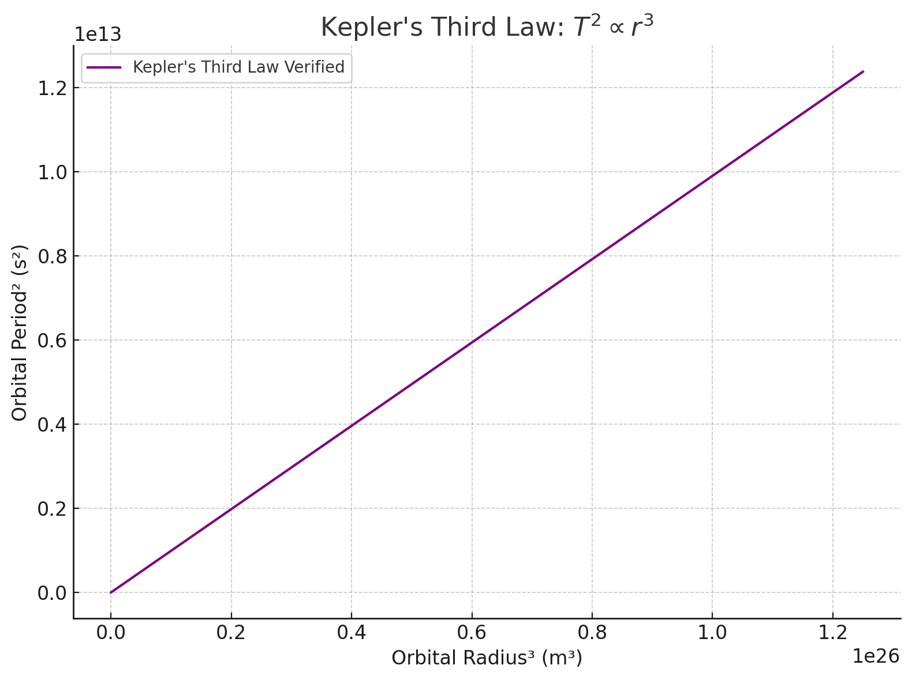

# Problem 1


---

## 📘 1. Theoretical Derivation

We begin with **Newton’s Law of Gravitation** and **centripetal force** for an object in **circular orbit**.

### 🧠 Newton’s Law of Universal Gravitation:
\[
F = \frac{G M m}{r^2}
\]

Where:
- \( F \): gravitational force
- \( G \): gravitational constant \(6.674 \times 10^{-11} \, \text{Nm}^2/\text{kg}^2\)
- \( M \): mass of central body (e.g., Earth or Sun)
- \( m \): mass of orbiting body
- \( r \): orbital radius

### 🌀 Centripetal Force for Circular Orbit:
\[
F = \frac{m v^2}{r}
\]

Set the two forces equal:

\[
\frac{G M m}{r^2} = \frac{m v^2}{r}
\]

Cancel \( m \) and solve for orbital velocity \( v \):

\[
v^2 = \frac{G M}{r}
\]

Now recall:
\[
v = \frac{2\pi r}{T}
\]

Plug into velocity equation:

\[
\left(\frac{2\pi r}{T}\right)^2 = \frac{G M}{r}
\]

\[
\frac{4\pi^2 r^2}{T^2} = \frac{G M}{r}
\]

Multiply both sides by \( T^2 r \):

\[
4\pi^2 r^3 = G M T^2
\]

Now solve for \( T^2 \):

\[
\boxed{T^2 = \frac{4\pi^2}{G M} \cdot r^3}
\]

This is **Kepler’s Third Law** — the square of the orbital period is **proportional to the cube of the orbital radius**.

---

## 🌌 2. Implications for Astronomy

- Helps determine **distances to planets** (e.g. using their periods)
- Lets us **calculate mass** of celestial bodies by rearranging the formula
- Applies to **moons**, **planets**, **satellites**, even **binary stars**

---

## 🌍 3. Real-World Example: The Moon

Let’s apply Kepler’s Law to the **Moon** orbiting Earth.

- Orbital radius \( r = 384,400 \) km = \( 3.844 \times 10^8 \) m  
- Mass of Earth \( M = 5.972 \times 10^{24} \) kg

We’ll plug into:

\[
T = 2\pi \sqrt{\frac{r^3}{G M}}
\]

---

## 💻 4. Python Simulation & Plot

Let’s write Python code to:

- Simulate planets with different orbital radii
- Calculate orbital periods
- Plot \( T^2 \) vs \( r^3 \) to verify linear relationship

```python
import numpy as np
import matplotlib.pyplot as plt

# Constants
G = 6.67430e-11  # gravitational constant
M = 5.972e24     # mass of Earth in kg

# Orbital radii in meters (from 1e7 m to 5e8 m)
radii = np.linspace(1e7, 5e8, 100)

# Calculate orbital periods
T = 2 * np.pi * np.sqrt(radii**3 / (G * M))

# Kepler's law verification: T^2 vs r^3
T_squared = T**2
r_cubed = radii**3

# Plotting
plt.figure(figsize=(8, 6))
plt.plot(r_cubed, T_squared, label="Kepler's Third Law Verified", color='purple')
plt.xlabel("Orbital Radius³ (m³)")
plt.ylabel("Orbital Period² (s²)")
plt.title("Kepler's Third Law: $T^2 \\propto r^3$")
plt.grid(True)
plt.legend()
plt.tight_layout()
plt.show()
```



---

## 📊 Deliverables Recap

- ✅ **Derivation**: Kepler’s 3rd Law from Newtonian gravity
- ✅ **Applications**: Planetary motion, satellites, moon orbits
- ✅ **Simulation**: Period vs Radius in Python
- ✅ **Plot**: Linear relationship between \( T^2 \) and \( r^3 \)