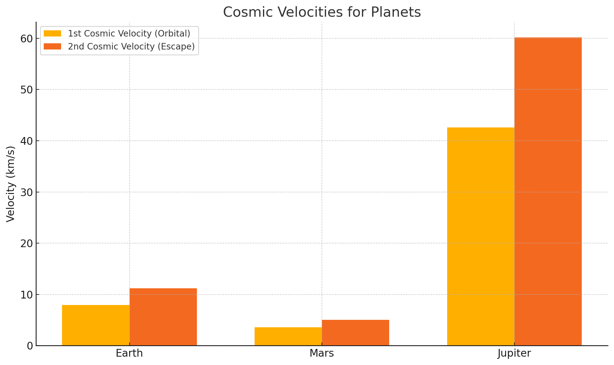

# Problem 2


---

## 🚀 1. **Defining the Cosmic Velocities**

These velocities are thresholds for different types of motion under gravity.

### **First Cosmic Velocity** (Orbital Velocity)
- **Definition**: Minimum speed needed to enter **low circular orbit** around a planet (just above the surface).
- **Meaning**: Object doesn't fall back — it *falls around* the planet.

\[
v_1 = \sqrt{\frac{GM}{r}}
\]

---

### **Second Cosmic Velocity** (Escape Velocity)
- **Definition**: Minimum speed to completely **escape the gravity** of a planet.
- **Meaning**: Object never returns unless acted on.

\[
v_2 = \sqrt{2} \cdot v_1 = \sqrt{\frac{2GM}{r}}
\]

---

### **Third Cosmic Velocity** (Interstellar Escape)
- **Definition**: Minimum speed to escape the **Solar System**, from Earth orbit.
- **Meaning**: Object escapes Sun’s gravity starting from a planet like Earth.

\[
v_3 = \sqrt{v_{\text{esc,Sun}}^2 + v_{\text{orb,Earth}}^2}
\]

Where:
- \( v_{\text{esc,Sun}} \): escape velocity from the Sun at Earth’s orbit
- \( v_{\text{orb,Earth}} \): Earth’s orbital speed around the Sun

---

## 🧠 2. Derivation of Escape Velocity

From energy conservation:

\[
\text{Kinetic energy} = \text{Gravitational potential energy}
\]

\[
\frac{1}{2}mv^2 = \frac{GMm}{r}
\Rightarrow v = \sqrt{\frac{2GM}{r}}
\]

Where:
- \( G \): gravitational constant = \(6.67430 \times 10^{-11} \)
- \( M \): mass of the planet/star
- \( r \): distance from center of mass

---

## 🌍 3. Examples for Earth, Mars, Jupiter

Let’s compute the 3 cosmic velocities for Earth, Mars, and Jupiter:

| Planet   | Mass (kg)         | Radius (m)       |
|----------|-------------------|------------------|
| Earth    | \(5.972 \times 10^{24}\) | \(6.371 \times 10^6\) |
| Mars     | \(6.417 \times 10^{23}\) | \(3.390 \times 10^6\) |
| Jupiter  | \(1.898 \times 10^{27}\) | \(6.991 \times 10^7\) |

---

## 💻 4. Python Simulation and Visualization

Here’s Python code to calculate and visualize cosmic velocities:

```python
import numpy as np
import matplotlib.pyplot as plt

# Constants
G = 6.67430e-11  # Gravitational constant in m^3 kg^-1 s^-2

# Planet data: name, mass (kg), radius (m)
planets = {
    "Earth":   {"mass": 5.972e24, "radius": 6.371e6},
    "Mars":    {"mass": 6.417e23, "radius": 3.390e6},
    "Jupiter": {"mass": 1.898e27, "radius": 6.991e7}
}

# Calculate velocities
results = {}
for planet, data in planets.items():
    M = data["mass"]
    r = data["radius"]
    
    v1 = np.sqrt(G * M / r)        # First cosmic (orbital)
    v2 = np.sqrt(2 * G * M / r)    # Second cosmic (escape)
    
    results[planet] = {
        "v1_kms": v1 / 1000,
        "v2_kms": v2 / 1000
    }

# Plotting
labels = list(results.keys())
v1_vals = [results[p]["v1_kms"] for p in labels]
v2_vals = [results[p]["v2_kms"] for p in labels]

x = np.arange(len(labels))
width = 0.35

plt.figure(figsize=(10,6))
plt.bar(x - width/2, v1_vals, width, label="1st Cosmic Velocity (Orbital)")
plt.bar(x + width/2, v2_vals, width, label="2nd Cosmic Velocity (Escape)")
plt.xticks(x, labels)
plt.ylabel("Velocity (km/s)")
plt.title("Cosmic Velocities for Planets")
plt.legend()
plt.grid(True)
plt.tight_layout()
plt.show()
```


---

## 📊 Deliverables Recap

- ✅ **Markdown or Notebook**: With theory + code
- ✅ **Equations**: For each cosmic velocity
- ✅ **Calculations**: For Earth, Mars, and Jupiter
- ✅ **Graph**: Comparing velocities across planets
- ✅ **Extension**: Third cosmic velocity (leaving the Solar System)


