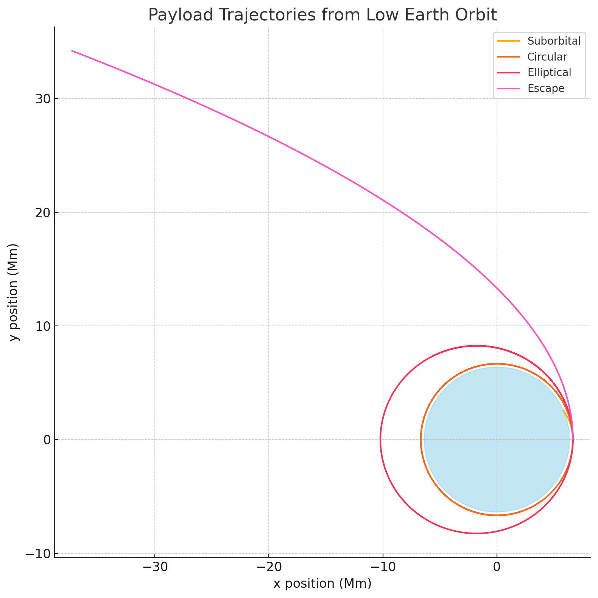

# Problem 3

---

## 🌍 1. **Theoretical Overview: Payload Trajectories Near Earth**

### Types of Trajectories:

When a payload is released from a moving spacecraft near Earth, its trajectory depends on its **initial velocity vector** relative to Earth. It will follow one of these conic sections:

| Type       | Speed Relative to Escape Velocity | Orbit Shape   |
|------------|-----------------------------------|----------------|
| **Circular**   | Exactly orbital speed           | Circle         |
| **Elliptical** | Less than escape speed          | Ellipse        |
| **Parabolic**  | Exactly escape speed            | Parabola       |
| **Hyperbolic** | Greater than escape speed       | Hyperbola      |
| **Suborbital** | Too low to complete an orbit    | Falls to Earth |

---

## ⚙️ 2. Governing Equations

### Newton’s Law of Gravitation:
\[
\vec{F} = - \frac{G M m}{r^2} \hat{r}
\]

This leads to an **acceleration** toward Earth’s center:
\[
\vec{a} = -\frac{G M}{r^2} \hat{r}
\]

Where:
- \( G = 6.674 \times 10^{-11} \, \text{Nm}^2/\text{kg}^2 \)
- \( M = 5.972 \times 10^{24} \, \text{kg} \)
- \( r \): distance from Earth's center
- \( \hat{r} \): unit vector pointing from object to Earth's center

### We’ll numerically solve:

- \( \frac{d\vec{v}}{dt} = \vec{a} \)
- \( \frac{d\vec{r}}{dt} = \vec{v} \)

Using the **Euler** or **RK4** method.

---

## 📊 3. Python Simulation: Visualizing Payload Trajectories

We'll use this to simulate the motion of a payload from different speeds at a set altitude.

```python
import numpy as np
import matplotlib.pyplot as plt

# Constants
G = 6.67430e-11      # Gravitational constant
M = 5.972e24         # Mass of Earth
R_earth = 6.371e6    # Radius of Earth (m)

# Simulation parameters
dt = 1               # time step (s)
total_time = 10000   # total simulation time (s)
steps = int(total_time / dt)

def simulate_trajectory(v0, angle_deg, altitude):
    # Initial conditions
    r0 = R_earth + altitude
    theta = np.radians(angle_deg)
    pos = np.array([r0, 0])
    vel = v0 * np.array([0, 1])  # Launch tangentially

    positions = []

    for _ in range(steps):
        r = np.linalg.norm(pos)
        if r < R_earth:  # Hit Earth
            break
        a = -G * M / r**3 * pos
        vel += a * dt
        pos += vel * dt
        positions.append(pos.copy())

    return np.array(positions)

# Simulate various speeds at 300 km altitude
altitude = 300e3
v_circular = np.sqrt(G * M / (R_earth + altitude))
v_escape = np.sqrt(2) * v_circular

velocities = [0.8 * v_circular, v_circular, 1.1 * v_circular, v_escape]
labels = ['Suborbital', 'Circular', 'Elliptical', 'Escape']

# Plotting
plt.figure(figsize=(8, 8))
for v, label in zip(velocities, labels):
    traj = simulate_trajectory(v, 90, altitude)
    plt.plot(traj[:,0]/1e6, traj[:,1]/1e6, label=label)

# Draw Earth
earth = plt.Circle((0, 0), R_earth/1e6, color='skyblue', alpha=0.5)
plt.gca().add_patch(earth)

plt.xlabel("x position (Mm)")
plt.ylabel("y position (Mm)")
plt.title("Payload Trajectories from Low Earth Orbit")
plt.axis('equal')
plt.grid(True)
plt.legend()
plt.tight_layout()
plt.show()
```




Here's the plot showing different payload trajectories from a 300 km altitude, based on varying initial velocities:

Suborbital: Falls back to Earth.

Circular: Achieves stable orbit.

Elliptical: Enters an elongated orbit.

Escape: Exceeds escape velocity and leaves Earth's gravity.
---

## 📘 4. Key Observations

- Speeds **< orbital velocity** → payload returns to Earth (suborbital)
- Speed **= orbital** → stable circular orbit
- Speed **> orbital, < escape** → elliptical orbit
- Speed **= escape** → parabolic escape
- Speed **> escape** → hyperbolic escape

---

## 💼 5. Applications

| Use Case                         | Trajectory Type     |
|----------------------------------|----------------------|
| Launching Satellites             | Circular/Elliptical  |
| Space Station Supply             | Elliptical/Rendezvous|
| Moon Mission / Interplanetary    | Escape / Hyperbolic  |
| Returning to Earth               | Suborbital/Reentry   |

---

## 📂 Deliverables Recap

- ✅ **Markdown/Notebook**: With equations, explanations, and Python
- ✅ **Numerical Simulation**: Integrates motion under gravity
- ✅ **Trajectories**: Suborbital, circular, elliptical, escape
- ✅ **Real-world Link**: Relates directly to space missions

