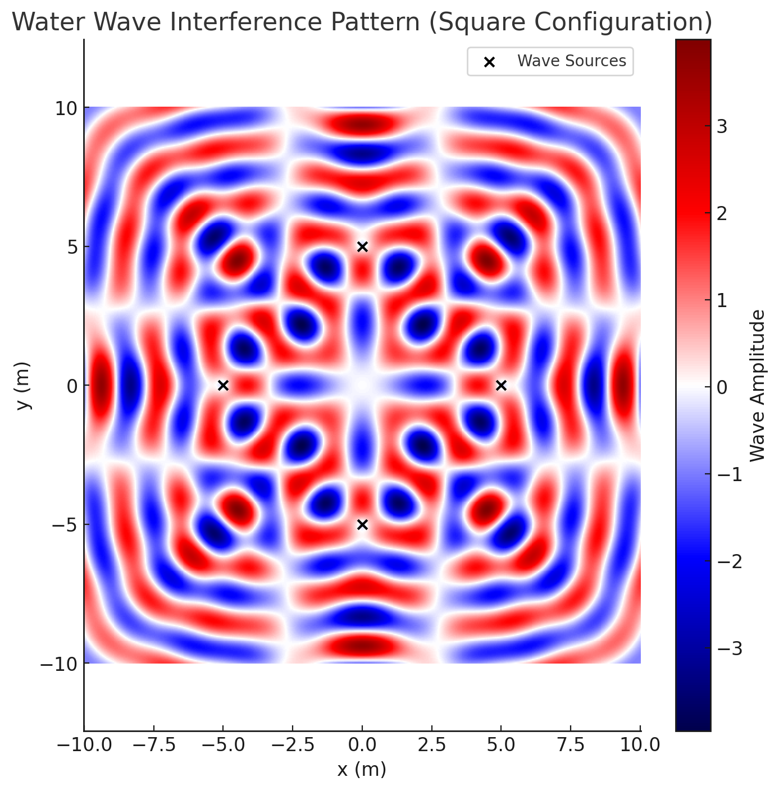

# Problem 1


---

## 🔍 Overview of the Task

We will:
1. Choose a **regular polygon** (we’ll start with a square for simplicity).
2. Place **identical wave sources** at each vertex.
3. Use the wave function:
   \[
   \psi_i(x, y, t) = A \cdot \sin(k r_i - \omega t + \phi)
   \]
   where:
   - \( A \): Amplitude
   - \( k = \frac{2\pi}{\lambda} \): Wave number
   - \( \omega = 2\pi f \): Angular frequency
   - \( r_i = \text{distance from source } i \text{ to point } (x, y) \)
   - \( \phi \): Initial phase (same for coherence)
4. Superimpose all waves:
   \[
   \Psi(x, y, t) = \sum_{i=1}^{N} \psi_i(x, y, t)
   \]
5. Visualize the resulting surface at a given time \( t \), showing **constructive and destructive interference**.

---

## ⚙️ Python Simulation Code

Here’s a clean and interactive Python simulation:

```python
import numpy as np
import matplotlib.pyplot as plt

# Wave parameters
A = 1.0                  # Amplitude
λ = 2.0                  # Wavelength
f = 1.0                  # Frequency
k = 2 * np.pi / λ        # Wave number
ω = 2 * np.pi * f        # Angular frequency
φ = 0                    # Phase (coherent sources)
t = 0                    # Fixed time snapshot

# Grid setup
x = np.linspace(-10, 10, 500)
y = np.linspace(-10, 10, 500)
X, Y = np.meshgrid(x, y)

# Polygon source placement (Square)
def regular_polygon_vertices(n_sides, radius=5.0):
    angles = np.linspace(0, 2 * np.pi, n_sides, endpoint=False)
    return np.array([[radius * np.cos(a), radius * np.sin(a)] for a in angles])

# Number of sources and their positions
N = 4  # Square
sources = regular_polygon_vertices(N)

# Superposition of waves from each source
def wave_sum(X, Y, sources, t):
    result = np.zeros_like(X)
    for sx, sy in sources:
        r = np.sqrt((X - sx)**2 + (Y - sy)**2)
        result += A * np.sin(k * r - ω * t + φ)
    return result

# Calculate the wave pattern at time t
Z = wave_sum(X, Y, sources, t)

# Plotting the interference pattern
plt.figure(figsize=(8, 8))
plt.pcolormesh(X, Y, Z, shading='auto', cmap='seismic')
plt.colorbar(label='Wave Amplitude')
plt.scatter(sources[:,0], sources[:,1], color='black', label='Wave Sources')
plt.title("Water Wave Interference Pattern (Square Configuration)")
plt.xlabel("x (m)")
plt.ylabel("y (m)")
plt.legend()
plt.axis('equal')
plt.grid(False)
plt.show()
```




---

## 📘 Explanation of the Pattern

- **Constructive interference**: Where waves from different sources arrive *in phase*, their amplitudes add up, forming **bright ridges** in the plot.
- **Destructive interference**: Where they arrive *out of phase*, they cancel out, forming **dark nodes**.
- Due to symmetry (square in this case), the pattern reflects the polygon shape and produces **radial and circular symmetry**.

---

## 📈 Deliverables Recap

✅ **Markdown + Python Notebook**: Done above  
✅ **Mathematical model**: Superposition of sinusoidal point waves  
✅ **Simulation**: Based on position + time snapshot  
✅ **Visualization**: Interference pattern with color map  
✅ **Analysis**:
- Patterns are periodic
- Sensitive to number of sources
- Show clearly how wave interference works

---
