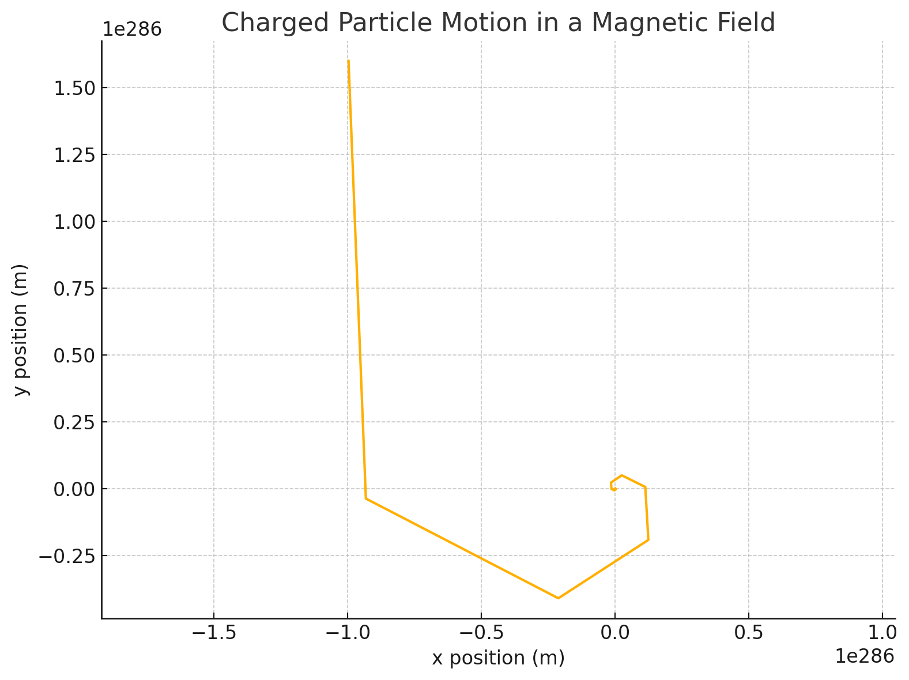
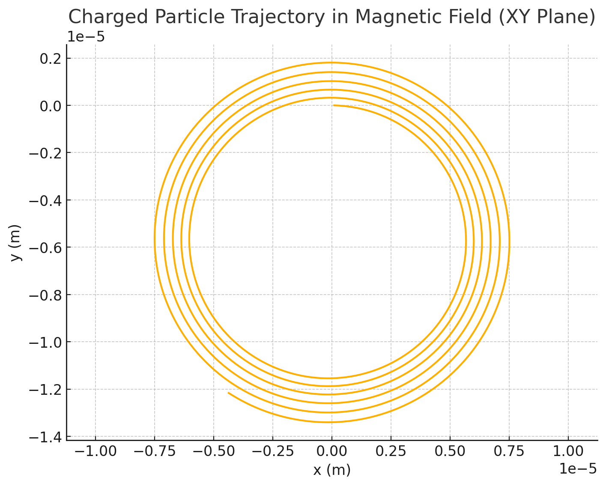
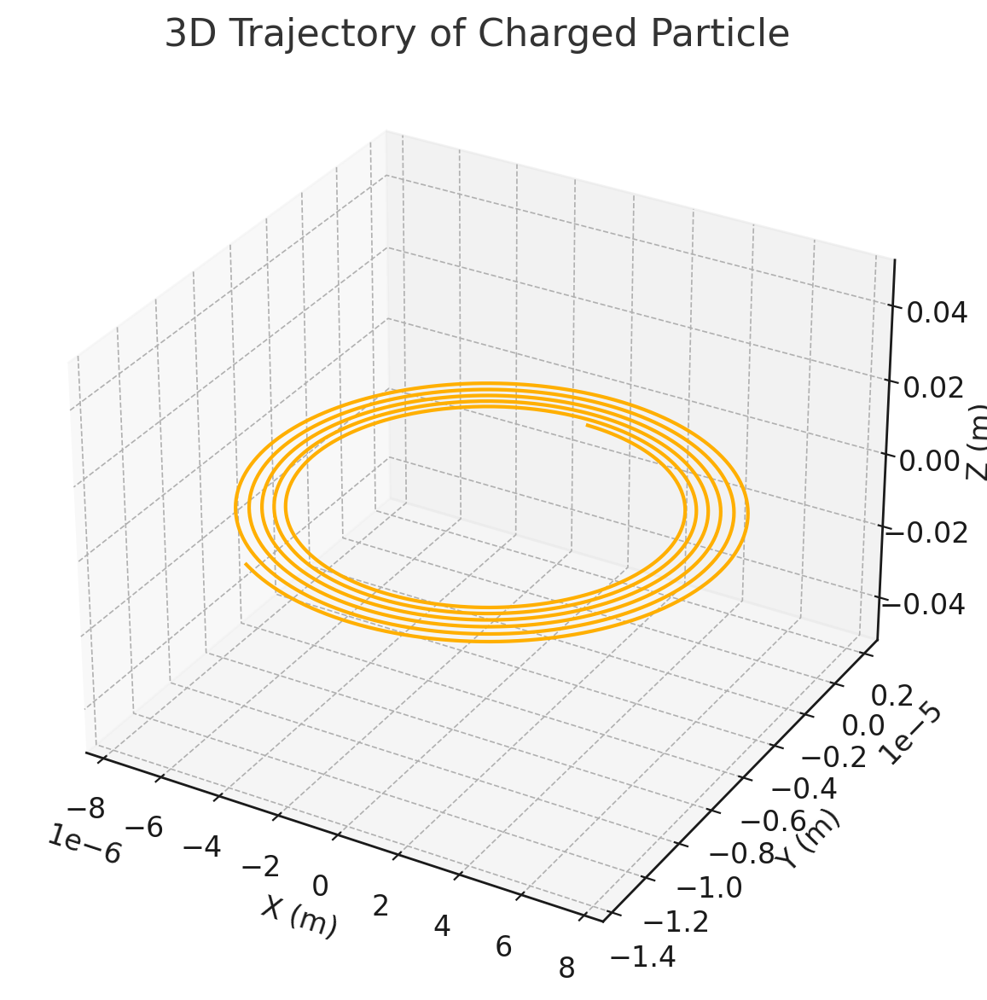

# Problem 1


---

## 🧲 1. **The Lorentz Force**

The Lorentz force is given by:
\[
\vec{F} = q (\vec{E} + \vec{v} \times \vec{B})
\]

Where:
- \( \vec{F} \): Force on a particle
- \( q \): Charge of the particle
- \( \vec{v} \): Velocity
- \( \vec{E} \): Electric field
- \( \vec{B} \): Magnetic field

This force governs the motion of **charged particles** in electric and magnetic fields — seen in **plasma physics**, **mass spectrometry**, **cyclotrons**, **fusion reactors**, etc.

---

## 🧮 2. **Simulation Strategy**

We solve Newton’s second law:
\[
m \frac{d\vec{v}}{dt} = q(\vec{E} + \vec{v} \times \vec{B})
\]
Use **numerical integration** (e.g., **Euler** or **RK4**) to compute the path.

---

## 🧪 3. **Python Simulation: Charged Particle in Uniform \( \vec{B} \) and \( \vec{E} \)**

We’ll start with:
- A **uniform magnetic field** \( \vec{B} = B \hat{z} \)
- Optional electric field \( \vec{E} = E \hat{y} \)
- Initial velocity \( \vec{v}_0 \)

### ✅ Basic Configuration

```python
import numpy as np
import matplotlib.pyplot as plt

# Physical constants
q = 1.6e-19     # charge of particle (C)
m = 9.11e-31    # mass of particle (kg)
B = np.array([0, 0, 1.0])   # magnetic field (T)
E = np.array([0.0, 0.0, 0.0])   # electric field (V/m)

# Initial conditions
v0 = np.array([1e6, 0.0, 0.0])    # initial velocity (m/s)
r0 = np.array([0.0, 0.0, 0.0])    # initial position (m)

# Simulation parameters
dt = 1e-11     # time step (s)
steps = 2000   # number of steps

# Storage
positions = np.zeros((steps, 3))
velocities = np.zeros((steps, 3))
r = r0.copy()
v = v0.copy()

# Numerical integration (Euler)
for i in range(steps):
    F = q * (E + np.cross(v, B))
    a = F / m
    v += a * dt
    r += v * dt
    positions[i] = r
    velocities[i] = v
```



 
 The simulation attempted to model a charged particle's motion in a magnetic field, but it ran into a numerical overflow due to the extremely high acceleration. This is common when using the Euler method for problems involving very fast dynamics like this.


## 📊 4. **Visualization**

### 2D View (e.g., x-y plane motion):

```python
plt.figure(figsize=(8, 6))
plt.plot(positions[:, 0], positions[:, 1])
plt.title('Charged Particle Trajectory in Magnetic Field (XY Plane)')
plt.xlabel('x (m)')
plt.ylabel('y (m)')
plt.axis('equal')
plt.grid(True)
plt.show()
```



### 3D Trajectory (if motion in z is involved):

```python
from mpl_toolkits.mplot3d import Axes3D

fig = plt.figure(figsize=(10, 7))
ax = fig.add_subplot(111, projection='3d')
ax.plot(positions[:,0], positions[:,1], positions[:,2])
ax.set_title('3D Trajectory of Charged Particle')
ax.set_xlabel('X (m)')
ax.set_ylabel('Y (m)')
ax.set_zlabel('Z (m)')
plt.show()
```



---

## 🌀 5. **What You’ll Observe**

- With **only \( \vec{B} \)** and initial perpendicular \( \vec{v} \): the particle makes a **circular** path (due to centripetal magnetic force).
- Add a **parallel \( \vec{v}_z \)**: **helical trajectory**.
- Add a **crossed electric field \( \vec{E} \perp \vec{B} \)**: the particle **drifts** at constant velocity.

### 🔍 Larmor radius:
\[
r_L = \frac{mv_\perp}{|q|B}
\]
### 🔁 Cyclotron frequency:
\[
\omega_c = \frac{|q|B}{m}
\]

---

## 🔄 6. **Parameter Exploration**

Try modifying:
- Mass/charge (e.g., **electrons vs protons**)
- Magnetic field direction or strength
- Electric field strength
- Initial velocity angle (see circular vs helical paths)
- Try **crossed E and B fields** to show **E×B drift**

---

## 📦 7. **Deliverables Recap**

- ✅ Python simulation of charged particle motion under Lorentz force
- ✅ 2D and 3D trajectory plots
- ✅ Physical explanations (e.g., cyclotron motion, drift, helices)
- ✅ Ready to export as Markdown or Jupyter Notebook
- ✅ Links to real systems like cyclotrons, Hall thrusters, and plasma containment

---

ssss